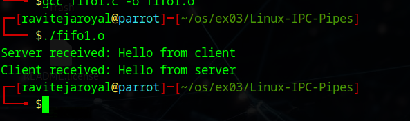

# Linux-IPC--Pipes
Linux-IPC-Pipes

# Ex03-Linux IPC - Pipes

# AIM:
To write a C program that illustrate communication between two process using unnamed and named pipes

# DESIGN STEPS:

### Step 1:

Navigate to any Linux environment installed on the system or installed inside a virtual environment like virtual box/vmware or online linux JSLinux (https://bellard.org/jslinux/vm.html?url=alpine-x86.cfg&mem=192) or docker.

### Step 2:

Write the C Program using Linux Process API - pipe(), fifo()

### Step 3:

Testing the C Program for the desired output. 

# PROGRAM
#include <stdio.h>
#include <stdlib.h>
#include <unistd.h>
#include <string.h>
#include <sys/wait.h>

void server(int readfd, int writefd);
void client(int writefd, int readfd);

int main() 
{
    int p1[2], p2[2];
    pid_t pid;

    // Create two pipes
    if (pipe(p1) == -1 || pipe(p2) == -1)
    {
        perror("Pipe failed");
        exit(1);
    }

    pid = fork();

    if (pid < 0)
    {
        perror("Fork failed");
        exit(1);
    }
    else if (pid == 0)
    {
        // Child process (Server)
        close(p1[1]);   // Close write end of pipe1
        close(p2[0]);   // Close read end of pipe2

        server(p1[0], p2[1]);
        exit(0);
    }
    else
    {
        // Parent process (Client)
        close(p1[0]);   // Close read end of pipe1
        close(p2[1]);   // Close write end of pipe2

        client(p1[1], p2[0]);

        wait(NULL);
    }

    return 0;
}

// Server function
void server(int readfd, int writefd)
{
    char buffer[100];

    // Read from client
    read(readfd, buffer, sizeof(buffer));
    printf("Server received: %s\n", buffer);

    // Send response
    char *msg = "Hello from server";
    write(writefd, msg, strlen(msg) + 1);
}

// Client function
void client(int writefd, int readfd)
{
    char buffer[100];

    // Send message to server
    char *msg = "Hello from client";
    write(writefd, msg, strlen(msg) + 1);

    // Read response
    read(readfd, buffer, sizeof(buffer));
    printf("Client received: %s\n", buffer);
}
## OUTPUT:

## C Program that illustrate communication between two process using named pipes using Linux API system calls

pipe1.c

#include <stdio.h>
#include <stdlib.h>
#include <unistd.h>
#include <fcntl.h>
#include <sys/types.h>
#include <sys/stat.h>
#include <string.h>

#define FIFO_FILE "/tmp/my_fifo"
#define FILE_NAME "hello.txt"

void server();
void client();

int main()
{
    pid_t pid;

    // Create FIFO (ignore error if already exists)
    if (mkfifo(FIFO_FILE, 0666) == -1)
    {
        // FIFO might already exist → ignore
    }

    pid = fork();

    if (pid > 0)
    {
        // Parent → Server
        sleep(1);  // Ensure client starts first
        server();
    }
    else if (pid == 0)
    {
        // Child → Client
        client();
    }
    else
    {
        perror("Fork failed");
        exit(EXIT_FAILURE);
    }

    return 0;
}

// 🔹 Server: Reads file and writes to FIFO
void server()
{
    int fifo_fd, file_fd;
    char buffer[1024];
    ssize_t bytes_read;

    file_fd = open(FILE_NAME, O_RDONLY);
    if (file_fd == -1)
    {
        perror("Error opening hello.txt");
        exit(EXIT_FAILURE);
    }

    fifo_fd = open(FIFO_FILE, O_WRONLY);
    if (fifo_fd == -1)
    {
        perror("Error opening FIFO");
        exit(EXIT_FAILURE);
    }

    while ((bytes_read = read(file_fd, buffer, sizeof(buffer))) > 0)
    {
        write(fifo_fd, buffer, bytes_read);
    }

    close(file_fd);
    close(fifo_fd);
}

// 🔹 Client: Reads from FIFO and prints
void client()
{
    int fifo_fd;
    char buffer[1024];
    ssize_t bytes_read;

    fifo_fd = open(FIFO_FILE, O_RDONLY);
    if (fifo_fd == -1)
    {
        perror("Error opening FIFO");
        exit(EXIT_FAILURE);
    }

    while ((bytes_read = read(fifo_fd, buffer, sizeof(buffer))) > 0)
    {
        write(STDOUT_FILENO, buffer, bytes_read);
    }

    close(fifo_fd);
}

## OUTPUT

# RESULT:
The program is executed successfully.
